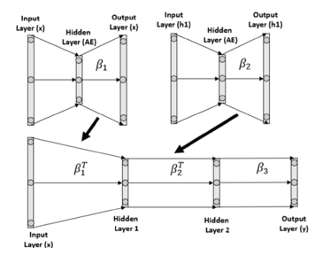
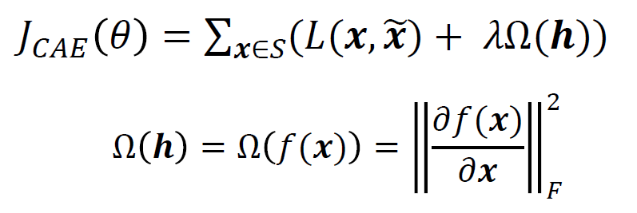

# Autoencoders
**_Implementation of different types of autoencoders in Pytorch_**

## Dataset
I subclassed Pytorch's MNIST as [FastMNIST](src/custom_mnist.py#L9) because it was very slow.
Usually DataLoaders in Pytorch pick a minibatch, apply transformations and load it into the GPU while the latter is computing
the previous minibatch. MNIST is very small though, and fits completely into the GPU memory. 
[FastMNIST](src/custom_mnist.py#L9) applies all the transformations at once and load all the data into the GPU. 
The use of DataLoaders is then completely bypassed to improved even more the performance, but this means that we cannot
iterate over minibatches in the fashion of `for minibatch_data, minibatch_targets in dataset_loader:...`, but at each
step it's necessary to select manually a portion of the dataset to pick as minibatch.

## Models
This repository contains implementations of:
- **Standard autoencoders** (shallow and deep)
- **Randomized autoencoders** (shallow and deep)
- **Convolutional autoencoders** (shallow and deep)

All these models can be:
- **Standard**: trained normally minimizing MSE between the output of the model and the input that was fed to it
- **Contractive**: the loss is the MSE plus a special regularization term
- **Denoising**: models are fed with a noisy input and the loss is the MSE between the output and a "clean" version of the input

### Randomized autoencoder
The model can be both shallow and deep, depending on the parameters passed to the constructor. 
It wants an iterable of integers called `dims`, containing the number of units
for each layer of the **encoder** (the decoder will have specular dimensions).
Therefore, the number of layers corresponds to the double of the length of `dims`.

#### Training of randomized autoencoder:
The model is trained through a **layer-wise pretraining**. 
For each layer :
- Create a shallow AE with the latent dim equal to the dim of 
- Initialize the weight matrices of the shallow encoder ()
- Freeze  and train the shallow AE updating only the decoder's weights
  ()
- Copy  in
   and
   in the corresponding layer
  of the original model's decoder (the one "specular" to )
  
The "encoder half" of this model can be used for represent a compressed embedding of data suitable for classification or regression.

### Convolutional autoencoders

#### Architecture of Conv AE
- **Encoder**:
  - Convolutional layers with ReLU activation function
    - Kernel size passed as argument, padding and stride calculated to maintain the same area of the feature maps
  - Max pooling (causes area reduction too)
  - FC layer(s) in the center to reduce dimensionality of the latent space
- **Decoder**:
  - Deconvolutional layers that restore the dimensions specularly
  - No upsampling, No unpooling

### Contractive autoencoders
They use a specific regularization term in the loss function:

Implemented it in [src/custom_losses.py](src/custom_losses.py). 
Subclassed a Pytorch's loss to make it use a function I created ([contractive_loss](src/custom_losses.py#L27)).
This way it's possible to use a custom loss as a normal Pytorch's one, without any change in the training cycle.

### Denoising autoencoders
I [subclassed Pytorch's MNIST](src/custom_mnist.py#L43) dataset to create a copy of the original data, called targets, and add noise to the data
to be fed to the model. The labels have been renamed from "targets" to "labels".

Note: to be precise, I subclassed Pytorch's MNIST as [FastMNIST](src/custom_mnist.py#L9) to improve
the performance, and then I subclassed the latter with [NoisyMNIST](src/custom_mnist.py#L43). 
See [here](#dataset) for details.

## Source files description
- [`autoencoders.py`](src/autoencoders.py): contains the classes implementing of the AE
- [`custom_losses.py`](src/custom_losses.py): contains the implementation of the loss for the contractive AE
- [`custom_mnist.py`](src/custom_mnist.py): contains my custom classes `FastMNIST` and `NoisyMNIST`
- [`training_utilities.py`](src/training_utilities.py): contains the functions for the **training cycle** and other useful functions
  during training.
- [`other_implementations`](src/other_implementations): directory containing implementations of a standard AE in Pytorch Lightning and Tensorflow (Keras) 
